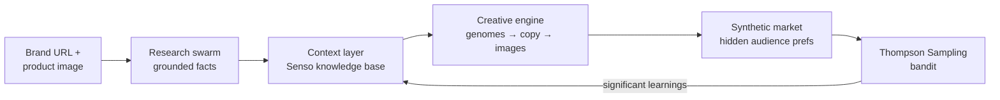

# SwarmAds — a self-improving advertising engine

Modern AI can generate ads, but it doesn't learn from them. SwarmAds closes the
loop: give it a brand URL and a product image, and a swarm of agents researches
the brand, generates competing ad creatives, tests them in a simulated market,
and **writes what it learned back into the brand's knowledge base** — so every
generation of ads starts from a richer understanding than the last.

## How the loop works



1. **Research** — agents (`scout → analyst → personasmith`) crawl the brand
   site and extract messaging, positioning, tone, value props, and audience.
   Every fact is verified against a source quote, so the context layer stays
   grounded rather than hallucinated.
2. **Generate** — the creative engine fans out ad *genomes* (combinations of
   messaging angle × hook × persona × visual style), writes copy for each,
   runs a compliance gate (drop/repair) and governance checks, then renders
   images with the product photo as the visual reference.
3. **Compete** — creatives run in a deterministic synthetic market with hidden
   audience preferences, creating a realistic optimization problem without
   spending real ad dollars.
4. **Learn** — a Thompson Sampling multi-armed bandit reallocates traffic
   toward winners while still exploring. Learnings must pass statistical
   significance checks (Wilson intervals) before they count.
5. **Evolve** — confirmed learnings are written back into the brand context,
   and generation 2 creatives are composed with the winning strategies as
   priors. The knowledge base and the ads improve together.

## Quickstart

Runs fully **offline on fixtures** by default — no env vars, no network, no DB:

```bash
npm i
npm run dev        # full clickable demo at localhost:3002
npm test           # simulator + loop tests (vitest)
npm run typecheck  # tsc --noEmit
```

The offline demo ships with a complete two-generation run for the demo brand
("Magic Spoon"): facts, creatives, panel scores, market metrics, and learnings.

### Live mode

Each sponsor integration sits behind a `USE_REAL_<X>=1` kill switch in
`.env.local` — unset means the local/mock fallback, so any subset can be live:

| Switch | Powers | Fallback when off |
|---|---|---|
| `USE_REAL_PIONEER` | all LLM tasks (research, personas, copy, evaluation) | mock copy/panel |
| `USE_REAL_SENSO` | context layer ingest / search / writeback | local context store |
| `USE_REAL_GEMINI` | image generation (`gemini-3.1-flash-image`) | OpenAI edits → SVG |
| `USE_REAL_BAND` | agent-to-agent comms, mirrored into the live event feed | local events only |
| `USE_REAL_ACTIAN` | vector store | in-memory vectors |

See [docs/WIRING.md](docs/WIRING.md) for the full wiring decisions and
[docs/INTEGRATION.md](docs/INTEGRATION.md) for integration details.

## Layout

- [src/lib/contracts.ts](src/lib/contracts.ts) — single type authority (all tracks build against this)
- [src/lib/agents/](src/lib/agents/) — research swarm + creative engine (copywriter, imagesmith, compliance)
- [src/lib/brief/](src/lib/brief/) — genome axes vocabulary + genome expansion
- [src/lib/loop/](src/lib/loop/) — Thompson Sampling, posteriors, Wilson significance, learnings
- [src/lib/sim.ts](src/lib/sim.ts) — pure, seeded market simulator (same seed → byte-identical output)
- [src/lib/context.ts](src/lib/context.ts) — Senso-backed context store + local fallback
- [src/lib/imagegen.ts](src/lib/imagegen.ts) — image chain: Gemini → OpenAI → SVG
- [src/fixtures/](src/fixtures/) — offline demo data for both generations
- [scripts/](scripts/) — fixture generation, smoke tests, standalone engine tests

## What's next

The current system learns inside a synthetic market. The natural next step is
connecting it to real platforms (Google Ads, Meta Ads) so the same loop learns
from live campaign performance — plus richer audience behavior, competitor
dynamics, and budget optimization in the simulator.
